# Airbnb Data Warehouse — dbt Project Architecture

High-level architecture of the **Bronze → Silver → Gold** medallion pipeline and how components connect.

---

## Architecture Diagram

```mermaid
flowchart TB
    subgraph SOURCES["📥 Sources (airbnb.staging)"]
        S_BOOKINGS[stage.bookings]
        S_HOSTS[stage.host]
        S_LISTINGS[stage.listings]
    end

    subgraph BRONZE["🥉 Bronze (airbnb_data_hub_bronze.airbnb_bronze_db)"]
        B_BOOKINGS[bronze_bookings_v1<br/><i>incremental • append • Delta</i>]
        B_HOSTS[bronze_hosts_v1<br/><i>incremental • append • Delta</i>]
        B_LISTINGS[bronze_listings_v1<br/><i>incremental • append • Delta</i>]
    end

    subgraph SILVER["🥈 Silver (airbnb_data_hub_silver.airbnb_silver_db)"]
        SV_BOOKINGS[silver_bookings<br/><i>incremental • merge • dedup</i>]
        SV_HOSTS[silver_hosts<br/><i>incremental • merge • dedup</i>]
        SV_LISTINGS[silver_listings<br/><i>incremental • merge • dedup</i>]
    end

    subgraph SNAPSHOTS["📸 Snapshots (airbnb_data_hub_gold.airbnb_gold_snapshot)"]
        SNP_HOSTS[snp_hosts<br/><i>SCD • check cols</i>]
        SNP_LISTINGS[snp_listings<br/><i>SCD • check cols</i>]
    end

    subgraph GOLD["🥇 Gold (airbnb_data_hub_gold.airbnb_gold_db)"]
        DIM_DATE[dim_date<br/><i>table • date spine</i>]
        DIM_HOST[dim_host<br/><i>incremental • SCD2 from snapshot</i>]
        DIM_LISTING[dim_listing<br/><i>incremental • SCD2 from snapshot</i>]
        DIM_STATUS[dim_booking_status<br/><i>seed / lookup</i>]
        FCT_BOOKINGS[fct_bookings<br/><i>incremental • fact</i>]
    end

    subgraph CONTROL["⚙️ Control"]
        CTRL[control_table<br/><i>watermarks per Gold table</i>]
    end

    S_BOOKINGS --> B_BOOKINGS
    S_HOSTS --> B_HOSTS
    S_LISTINGS --> B_LISTINGS

    B_BOOKINGS --> SV_BOOKINGS
    B_HOSTS --> SV_HOSTS
    B_LISTINGS --> SV_LISTINGS

    SV_HOSTS --> SNP_HOSTS
    SV_LISTINGS --> SNP_LISTINGS

    SNP_HOSTS --> DIM_HOST
    SNP_LISTINGS --> DIM_LISTING

    DIM_DATE -.->|date_key / reference| FCT_BOOKINGS
    DIM_HOST --> FCT_BOOKINGS
    DIM_LISTING --> FCT_BOOKINGS
    DIM_STATUS --> FCT_BOOKINGS
    SV_BOOKINGS --> FCT_BOOKINGS

    DIM_HOST --> CTRL
    DIM_LISTING --> CTRL
    FCT_BOOKINGS --> CTRL
```

---

## Simplified Data Flow

---

## Layer Summary

| Layer      | Catalog / Schema                         | Purpose |
|-----------|-------------------------------------------|--------|
| **Sources** | `airbnb.staging`                         | Raw tables: `bookings`, `hosts`, `listings` |
| **Bronze**  | `airbnb_data_hub_bronze.airbnb_bronze_db` | Raw copy + `_bronze_loaded_at`, `_bronze_load_date`; incremental append, Delta |
| **Silver**  | `airbnb_data_hub_silver.airbnb_silver_db` | Deduplicated, merged; incremental merge, Delta |
| **Snapshots** | `airbnb_data_hub_gold.airbnb_gold_snapshot` | SCD history for `snp_hosts`, `snp_listings` |
| **Gold**   | `airbnb_data_hub_gold.airbnb_gold_db`     | Star schema: `dim_date`, `dim_host`, `dim_listing`, `dim_booking_status`, `fct_bookings` |
| **Control** | `airbnb_data_hub_gold.airbnb_gold_db.control_table` | Watermarks for incremental Gold loads |

---

## Key Design Choices

- **Medallion**: Bronze (raw) → Silver (cleaned) → Gold (analytics).
- **Incremental**: Bronze append; Silver/Gold merge with keys and watermarks.
- **SCD Type 2**: `snp_hosts` and `snp_listings` feed `dim_host` and `dim_listing` with `effective_from` / `effective_to`.
- **Control table**: Tracks last processed timestamp per Gold table for incremental and idempotent runs.
- **Seeds**: `dim_booking_status` is a seed used as a lookup in `fct_bookings`.
- **Macros**: `get_control_watermark`, `update_control_watermark`, `generate_schema_name` support incremental and multi-environment behavior.

---

*Generated for the `data_warehouse` dbt project.*
